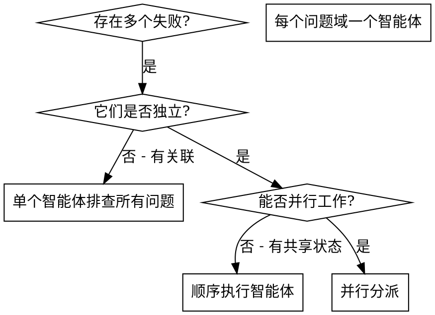

# 并行分派智能体

## 概述

你将任务委派给具有隔离上下文的专用智能体。通过精心设计它们的指令和上下文，确保它们专注并成功完成任务。它们不应继承你的会话上下文或历史记录——你要精确构造它们所需的一切。这样也能为你自己保留用于协调工作的上下文。

当你遇到多个不相关的失败（不同的测试文件、不同的子系统、不同的 bug），逐一排查会浪费时间。每个排查都是独立的，可以并行进行。

**核心原则：** 每个独立问题域分派一个智能体，让它们并发工作。

## 何时使用



**适用场景：**
- 3 个以上测试文件因不同根因失败
- 多个子系统独立出现故障
- 每个问题无需其他问题的上下文即可理解
- 排查之间无共享状态

**不适用场景：**
- 失败是相关的（修复一个可能修复其他的）
- 需要理解完整的系统状态
- 智能体之间会互相干扰

## 模式

### 1. 识别独立的问题域

按故障分组：
- 文件 A 测试：工具审批流程
- 文件 B 测试：批量完成行为
- 文件 C 测试：中止功能

每个问题域是独立的——修复工具审批不会影响中止测试。

### 2. 创建聚焦的智能体任务

每个智能体获得：
- **明确范围：** 一个测试文件或子系统
- **清晰目标：** 让这些测试通过
- **约束条件：** 不修改其他代码
- **预期输出：** 你发现和修复内容的总结

### 3. 并行分派

```typescript
// 在 Claude Code / AI 环境中
Task("修复 agent-tool-abort.test.ts 的失败")
Task("修复 batch-completion-behavior.test.ts 的失败")
Task("修复 tool-approval-race-conditions.test.ts 的失败")
// 三个任务并发运行
```

### 4. 审查与集成

当智能体返回时：
- 阅读每个总结
- 验证修复之间没有冲突
- 运行完整测试套件
- 集成所有更改

## 智能体提示词结构

好的智能体提示词应该是：
1. **聚焦的** - 一个清晰的问题域
2. **自包含的** - 包含理解问题所需的所有上下文
3. **明确输出要求** - 智能体应该返回什么？

```markdown
修复 src/agents/agent-tool-abort.test.ts 中 3 个失败的测试：

1. "should abort tool with partial output capture" - 期望消息中包含 'interrupted at'
2. "should handle mixed completed and aborted tools" - 快速工具被中止而非完成
3. "should properly track pendingToolCount" - 期望 3 个结果但得到 0 个

这些是时序/竞态条件问题。你的任务：

1. 阅读测试文件，理解每个测试验证的内容
2. 找到根因——是时序问题还是实际 bug？
3. 修复方式：
   - 用基于事件的等待替换任意超时
   - 如果发现中止实现中的 bug 则修复
   - 如果测试的是已变更的行为则调整测试期望

不要只是增加超时时间——找到真正的问题。

返回：你发现了什么以及修复了什么的总结。
```

## 常见错误

**错误做法：太宽泛：** "修复所有测试" - 智能体会迷失方向
**正确做法：具体明确：** "修复 agent-tool-abort.test.ts" - 聚焦的范围

**错误做法：无上下文：** "修复竞态条件" - 智能体不知道在哪里
**正确做法：提供上下文：** 粘贴错误信息和测试名称

**错误做法：无约束：** 智能体可能会重构所有代码
**正确做法：设置约束：** "不要修改生产代码" 或 "只修复测试"

**错误做法：模糊的输出要求：** "修好它" - 你不知道改了什么
**正确做法：明确要求：** "返回根因和修改内容的总结"

## 不适用的场景

**关联性失败：** 修复一个可能修复其他的——先一起排查
**需要完整上下文：** 理解问题需要看到整个系统
**探索性调试：** 你还不知道什么坏了
**共享状态：** 智能体会互相干扰（编辑同一文件、使用同一资源）

## 实际案例

**场景：** 大规模重构后，3 个文件中出现 6 个测试失败

**失败情况：**
- agent-tool-abort.test.ts：3 个失败（时序问题）
- batch-completion-behavior.test.ts：2 个失败（工具未执行）
- tool-approval-race-conditions.test.ts：1 个失败（执行计数 = 0）

**决策：** 独立的问题域——中止逻辑、批量完成、竞态条件各自独立

**分派：**
```
智能体 1 → 修复 agent-tool-abort.test.ts
智能体 2 → 修复 batch-completion-behavior.test.ts
智能体 3 → 修复 tool-approval-race-conditions.test.ts
```

**结果：**
- 智能体 1：用基于事件的等待替换了超时
- 智能体 2：修复了事件结构 bug（threadId 位置不对）
- 智能体 3：添加了等待异步工具执行完成的逻辑

**集成：** 所有修复互相独立，无冲突，完整测试套件全部通过

**节省的时间：** 3 个问题并行解决 vs 顺序解决

## 核心优势

1. **并行化** - 多个排查同时进行
2. **聚焦** - 每个智能体范围窄，需要跟踪的上下文少
3. **独立性** - 智能体之间互不干扰
4. **速度** - 3 个问题在 1 个问题的时间内解决

## 验证

智能体返回后：
1. **审查每个总结** - 理解改了什么
2. **检查冲突** - 智能体是否编辑了同一段代码？
3. **运行完整套件** - 验证所有修复协同工作
4. **抽查** - 智能体可能犯系统性错误

## 实际效果

来自调试会话（2025-10-03）：
- 3 个文件中 6 个失败
- 并行分派 3 个智能体
- 所有排查并发完成
- 所有修复成功集成
- 智能体之间的更改零冲突
