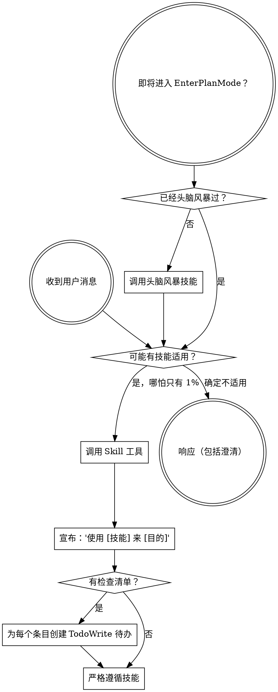

<SUBAGENT-STOP>
如果你是作为子智能体被分派来执行特定任务的，跳过此技能。
</SUBAGENT-STOP>

<EXTREMELY-IMPORTANT>
如果你认为哪怕只有 1% 的可能性某个技能适用于你正在做的事情，你绝对必须调用该技能。

如果一个技能适用于你的任务，你没有选择。你必须使用它。

这不可协商。这不是可选的。你不能通过合理化来逃避。
</EXTREMELY-IMPORTANT>

## 指令优先级

Superpowers 技能覆盖默认系统提示行为，但**用户指令始终具有最高优先级**：

1. **用户的明确指令**（CLAUDE.md、GEMINI.md、AGENTS.md、直接请求）——最高优先级
2. **Superpowers 技能** ——在冲突处覆盖默认系统行为
3. **默认系统提示** ——最低优先级

如果 CLAUDE.md、GEMINI.md 或 AGENTS.md 说"不要使用 TDD"，而某个技能说"始终使用 TDD"，遵循用户的指令。用户拥有控制权。

## 如何访问技能

**在 Claude Code 中：** 使用 `Skill` 工具。当你调用一个技能时，其内容会被加载并呈现给你——直接遵循即可。绝不要用 Read 工具读取技能文件。

**在 Gemini CLI 中：** 技能通过 `activate_skill` 工具激活。Gemini 在会话开始时加载技能元数据，并按需激活完整内容。

**在其他环境中：** 查看你的平台文档了解技能的加载方式。

## 平台适配

技能使用 Claude Code 的工具名称。非 CC 平台：查看 `references/codex-tools.md`（Codex）了解工具对应关系。Gemini CLI 用户通过 GEMINI.md 自动获得工具映射。

# 使用技能

## 规则

**在任何响应或操作之前调用相关或被请求的技能。** 哪怕只有 1% 的可能性某个技能适用，你都应该调用该技能来检查。如果调用后发现技能不适合当前情况，你不需要使用它。

## 红线

这些想法意味着停下——你在合理化：

| 想法 | 现实 |
|------|------|
| "这只是一个简单的问题" | 问题就是任务。检查技能。 |
| "我需要先了解更多上下文" | 技能检查在澄清性问题之前。 |
| "让我先探索一下代码库" | 技能告诉你如何探索。先检查。 |
| "我可以快速查一下 git/文件" | 文件缺少对话上下文。检查技能。 |
| "让我先收集信息" | 技能告诉你如何收集信息。 |
| "这不需要正式的技能" | 如果技能存在，就使用它。 |
| "我记得这个技能" | 技能会迭代更新。阅读当前版本。 |
| "这不算一个任务" | 行动 = 任务。检查技能。 |
| "技能太小题大做了" | 简单的事会变复杂。使用它。 |
| "让我先做这一件事" | 在做任何事之前先检查。 |
| "这样做感觉很高效" | 无纪律的行动浪费时间。技能防止这一点。 |
| "我知道那是什么意思" | 知道概念 ≠ 使用技能。调用它。 |

## 技能优先级

当多个技能可能适用时，使用此顺序：

1. **流程技能优先**（头脑风暴、调试）- 这些决定如何处理任务
2. **实现技能其次**（前端设计、mcp-builder）- 这些指导执行

"让我们构建 X" → 先头脑风暴，再使用实现技能。
"修复这个 bug" → 先调试，再使用领域特定技能。

## 中国特色技能路由

当检测到以下场景时，**必须**优先调用对应的中国特色技能：

| 场景 | 调用技能 |
|------|---------|
| 代码审查且团队使用中文沟通 | **superpowers:chinese-code-review** |
| 使用 Gitee/Coding/极狐 GitLab | **superpowers:chinese-git-workflow** |
| 编写中文技术文档或 README | **superpowers:chinese-documentation** |
| 编写 git commit message（中文项目） | **superpowers:chinese-commit-conventions** |
| 构建 MCP 服务器/工具 | **superpowers:mcp-builder** |

**判断依据：**
- 项目中有中文注释、中文 README、或 .gitee 目录 → 启用中文系列技能
- commit 历史中有中文 → 使用中文提交规范
- 用户用中文交流 → 所有输出使用中文，优先考虑中国特色技能

中国特色技能与翻译技能**叠加使用**，不互斥。例如：做代码审查时，同时使用 requesting-code-review（流程）+ chinese-code-review（风格）。

## 技能类型

**刚性的**（TDD、调试）：严格遵循。不要偏离纪律。

**灵活的**（模式）：根据上下文调整原则。

技能本身会告诉你它属于哪种。

## 用户指令

指令说明做什么，而非怎么做。"添加 X"或"修复 Y"不意味着跳过工作流。
