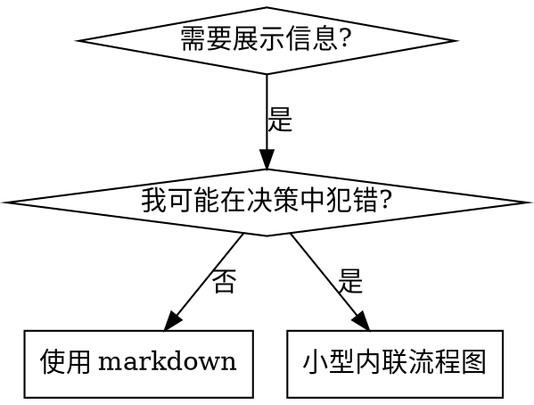

# 编写技能

## 概述

**编写技能就是将测试驱动开发应用于流程文档。**

**个人技能存放在智能体特定的目录中（Claude Code 用 `~/.claude/skills`，Codex 用 `~/.agents/skills/`）**

你编写测试用例（带子智能体的压力场景），观察它们失败（基线行为），编写技能（文档），观察测试通过（智能体遵守规则），然后重构（堵住漏洞）。

**核心原则：** 如果你没有观察到智能体在没有该技能时失败，你就不知道这个技能是否教了正确的东西。

**必需背景：** 在使用此技能前，你必须理解 superpowers:test-driven-development。该技能定义了基本的红-绿-重构循环。本技能将 TDD 适配到文档编写中。

**官方指南：** Anthropic 官方的技能编写最佳实践请参见 anthropic-best-practices.md。该文档提供了补充本技能 TDD 导向方法的额外模式和指南。

## 什么是技能？

**技能**是经过验证的技术、模式或工具的参考指南。技能帮助未来的 Claude 实例找到并应用有效的方法。

**技能是：** 可复用的技术、模式、工具、参考指南

**技能不是：** 关于你某次如何解决问题的叙事

## TDD 映射到技能

| TDD 概念 | 技能创建 |
|----------|---------|
| **测试用例** | 带子智能体的压力场景 |
| **生产代码** | 技能文档（SKILL.md） |
| **测试失败（红）** | 智能体在没有技能时违反规则（基线） |
| **测试通过（绿）** | 智能体在有技能时遵守规则 |
| **重构** | 在保持合规的同时堵住漏洞 |
| **先写测试** | 在编写技能之前先运行基线场景 |
| **观察失败** | 记录智能体使用的确切合理化借口 |
| **最小代码** | 编写针对那些具体违规行为的技能 |
| **观察通过** | 验证智能体现在遵守规则 |
| **重构循环** | 发现新的合理化借口 → 堵住 → 重新验证 |

整个技能创建过程遵循红-绿-重构。

## 何时创建技能

**创建条件：**
- 技术对你来说不是直觉上显而易见的
- 你会在不同项目中反复引用
- 模式具有广泛适用性（非项目特定）
- 其他人也会受益

**不要创建：**
- 一次性解决方案
- 其他地方有充分文档的标准实践
- 项目特定的约定（放在 CLAUDE.md 中）
- 机械性约束（如果可以用正则/验证强制执行，就自动化——文档留给需要判断的场景）

## 技能类型

### 技术类
有具体步骤的方法（condition-based-waiting、root-cause-tracing）

### 模式类
思考问题的方式（flatten-with-flags、test-invariants）

### 参考类
API 文档、语法指南、工具文档（office docs）

## 目录结构

```
skills/
  skill-name/
    SKILL.md              # 主参考文档（必需）
    supporting-file.*     # 仅在需要时
```

**扁平命名空间** - 所有技能在一个可搜索的命名空间中

**分离文件的情况：**
1. **大量参考内容**（100+ 行）- API 文档、全面的语法说明
2. **可复用工具** - 脚本、实用程序、模板

**保持内联：**
- 原则和概念
- 代码模式（< 50 行）
- 其他所有内容

## SKILL.md 结构

**Frontmatter（YAML）：**
- 两个必需字段：`name` 和 `description`（完整支持字段参见 [agentskills.io/specification](https://agentskills.io/specification)）
- 总计最多 1024 字符
- `name`：只使用字母、数字和连字符（不要用括号、特殊字符）
- `description`：第三人称，仅描述何时使用（不是做什么）
  - 以"Use when..."开头，聚焦于触发条件
  - 包含具体的症状、场景和上下文
  - **绝不总结技能的流程或工作流**（参见 CSO 章节了解原因）
  - 尽量控制在 500 字符以内

```markdown
---
name: Skill-Name-With-Hyphens
description: Use when [具体的触发条件和症状]
---

# 技能名称

## 概述
这是什么？用 1-2 句话说明核心原则。

## 何时使用
[如果决策不明显，使用小型内联流程图]

症状和用例的要点列表
不适用的场景

## 核心模式（技术/模式类）
前后代码对比

## 快速参考
用于快速浏览常见操作的表格或要点

## 实现
简单模式内联代码
大量参考或可复用工具链接到文件

## 常见错误
常见问题 + 修复方法

## 实际效果（可选）
具体结果
```


## Claude 搜索优化（CSO）

**发现至关重要：** 未来的 Claude 需要找到你的技能

### 1. 丰富的描述字段

**目的：** Claude 读取描述来决定为当前任务加载哪些技能。让它能回答："我现在应该读这个技能吗？"

**格式：** 以"Use when..."开头，聚焦于触发条件

**关键：描述 = 何时使用，不是技能做什么**

描述应该只描述触发条件。不要在描述中总结技能的流程或工作流。

**为什么这很重要：** 测试表明，当描述总结了技能的工作流时，Claude 可能会跟随描述而非阅读完整的技能内容。一个写着"任务间进行代码审查"的描述导致 Claude 只做了一次审查，尽管技能的流程图清楚地展示了两次审查（先规格合规再代码质量）。

当描述改为仅"在当前会话中执行包含独立任务的实现计划时使用"（无工作流摘要）时，Claude 正确地阅读了流程图并遵循了两阶段审查流程。

**陷阱：** 总结工作流的描述创建了 Claude 会走的捷径。技能正文变成了 Claude 跳过的文档。

```yaml
# 错误：总结了工作流 - Claude 可能会跟随描述而非阅读技能
description: Use when executing plans - dispatches subagent per task with code review between tasks

# 错误：流程细节太多
description: Use for TDD - write test first, watch it fail, write minimal code, refactor

# 正确：只有触发条件，无工作流摘要
description: Use when executing implementation plans with independent tasks in the current session

# 正确：仅触发条件
description: Use when implementing any feature or bugfix, before writing implementation code
```

**内容：**
- 使用具体的触发条件、症状和场景来表明此技能适用
- 描述问题（竞态条件、行为不一致）而非语言特定的症状（setTimeout、sleep）
- 保持触发条件技术无关，除非技能本身是技术特定的
- 如果技能是技术特定的，在触发条件中明确说明
- 用第三人称写（注入到系统提示中）
- **绝不总结技能的流程或工作流**

```yaml
# 错误：太抽象、模糊，未包含何时使用
description: For async testing

# 错误：第一人称
description: I can help you with async tests when they're flaky

# 错误：提到了技术但技能并非该技术特定的
description: Use when tests use setTimeout/sleep and are flaky

# 正确：以"Use when"开头，描述问题，无工作流
description: Use when tests have race conditions, timing dependencies, or pass/fail inconsistently

# 正确：技术特定的技能带有明确的触发条件
description: Use when using React Router and handling authentication redirects
```

### 2. 关键词覆盖

使用 Claude 会搜索的词语：
- 错误信息："Hook timed out"、"ENOTEMPTY"、"race condition"
- 症状："flaky"、"hanging"、"zombie"、"pollution"
- 同义词："timeout/hang/freeze"、"cleanup/teardown/afterEach"
- 工具：实际命令、库名称、文件类型

### 3. 描述性命名

**使用主动语态，动词优先：**
- ✅ `creating-skills` 而非 `skill-creation`
- ✅ `condition-based-waiting` 而非 `async-test-helpers`

### 4. Token 效率（关键）

**问题：** getting-started 和频繁引用的技能会加载到每个对话中。每个 token 都很重要。

**目标字数：**
- getting-started 工作流：每个 <150 词
- 频繁加载的技能：总计 <200 词
- 其他技能：<500 词（仍要简洁）

**技巧：**

**将细节移到工具帮助中：**
```bash
# 错误：在 SKILL.md 中列出所有参数
search-conversations supports --text, --both, --after DATE, --before DATE, --limit N

# 正确：引用 --help
search-conversations 支持多种模式和过滤器。运行 --help 查看详情。
```

**使用交叉引用：**
```markdown
# 错误：重复工作流细节
搜索时，用模板分派子智能体……
[20 行重复的说明]

# 正确：引用其他技能
始终使用子智能体（节省 50-100 倍上下文）。必需：使用 [other-skill-name] 工作流。
```

**压缩示例：**
```markdown
# 错误：冗长的示例（42 词）
你的搭档："我们之前是怎么处理 React Router 中的认证错误的？"
你：我来搜索过去对话中的 React Router 认证模式。
[用搜索查询分派子智能体："React Router authentication error handling 401"]

# 正确：精简的示例（20 词）
搭档："我们之前是怎么处理 React Router 中的认证错误的？"
你：正在搜索……
[分派子智能体 → 整合]
```

**消除冗余：**
- 不要重复交叉引用的技能中已有的内容
- 不要解释从命令中就能看出的东西
- 不要为同一模式提供多个示例

**验证：**
```bash
wc -w skills/path/SKILL.md
# getting-started 工作流：目标 <150 每个
# 其他频繁加载的：目标总计 <200
```

**用你做的事或核心洞察来命名：**
- ✅ `condition-based-waiting` > `async-test-helpers`
- ✅ `using-skills` 而非 `skill-usage`
- ✅ `flatten-with-flags` > `data-structure-refactoring`
- ✅ `root-cause-tracing` > `debugging-techniques`

**动名词（-ing）适合描述流程：**
- `creating-skills`、`testing-skills`、`debugging-with-logs`
- 主动的，描述你正在进行的操作

### 4. 交叉引用其他技能

**编写引用其他技能的文档时：**

仅使用技能名称，带有明确的必需标记：
- ✅ 好的：`**必需子技能：** 使用 superpowers:test-driven-development`
- ✅ 好的：`**必需背景：** 你必须理解 superpowers:systematic-debugging`
- ❌ 差的：`参见 skills/testing/test-driven-development`（不清楚是否必需）
- ❌ 差的：`@skills/testing/test-driven-development/SKILL.md`（强制加载，浪费上下文）

**为什么不用 @ 链接：** `@` 语法会立即强制加载文件，在你需要之前就消耗 200k+ 的上下文。

## 流程图使用



**仅在以下情况使用流程图：**
- 非显而易见的决策点
- 你可能过早停止的流程循环
- "何时使用 A vs B"的决策

**绝不使用流程图用于：**
- 参考资料 → 表格、列表
- 代码示例 → Markdown 代码块
- 线性指令 → 编号列表
- 无语义意义的标签（step1、helper2）

参见 @graphviz-conventions.dot 了解 graphviz 样式规则。

**为你的搭档可视化：** 使用此目录中的 `render-graphs.js` 将技能的流程图渲染为 SVG：
```bash
./render-graphs.js ../some-skill           # 每个图表分别渲染
./render-graphs.js ../some-skill --combine # 所有图表合并为一个 SVG
```

## 代码示例

**一个优秀的示例胜过多个平庸的**

选择最相关的语言：
- 测试技术 → TypeScript/JavaScript
- 系统调试 → Shell/Python
- 数据处理 → Python

**好的示例：**
- 完整可运行
- 注释良好，解释为什么
- 来自真实场景
- 清晰展示模式
- 可以直接适配（不是通用模板）

**不要：**
- 用 5 种以上语言实现
- 创建填空模板
- 写人为构造的示例

你擅长语言移植——一个优秀的示例就够了。

## 文件组织

### 自包含技能
```
defense-in-depth/
  SKILL.md    # 所有内容内联
```
适用场景：所有内容都能放下，无需大量参考

### 带可复用工具的技能
```
condition-based-waiting/
  SKILL.md    # 概述 + 模式
  example.ts  # 可适配的工作代码
```
适用场景：工具是可复用的代码，不只是叙述

### 带大量参考的技能
```
pptx/
  SKILL.md       # 概述 + 工作流
  pptxgenjs.md   # 600 行 API 参考
  ooxml.md       # 500 行 XML 结构
  scripts/       # 可执行工具
```
适用场景：参考资料太多无法内联

## 铁律（与 TDD 相同）

```
没有失败的测试就不写技能
```

这适用于新技能和对现有技能的编辑。

先写技能再测试？删掉它。重新开始。
编辑技能不测试？同样违规。

**无例外：**
- 不适用于"简单的添加"
- 不适用于"只是加一个章节"
- 不适用于"文档更新"
- 不要保留未测试的更改作为"参考"
- 不要在运行测试时"调整"
- 删除就是删除

**必需背景：** superpowers:test-driven-development 技能解释了为什么这很重要。相同的原则适用于文档。

## 测试所有技能类型

不同类型的技能需要不同的测试方法：

### 纪律执行类技能（规则/要求）

**例如：** TDD、完成前验证、编码前设计

**测试方式：**
- 学术性问题：它们理解规则吗？
- 压力场景：它们在压力下遵守吗？
- 多重压力组合：时间 + 沉没成本 + 疲惫
- 识别合理化借口并添加明确的反驳

**成功标准：** 智能体在最大压力下遵循规则

### 技术类技能（操作指南）

**例如：** condition-based-waiting、root-cause-tracing、defensive-programming

**测试方式：**
- 应用场景：它们能正确应用技术吗？
- 变体场景：它们能处理边界情况吗？
- 缺失信息测试：说明是否有遗漏？

**成功标准：** 智能体成功将技术应用于新场景

### 模式类技能（心智模型）

**例如：** reducing-complexity、information-hiding 概念

**测试方式：**
- 识别场景：它们能识别模式何时适用吗？
- 应用场景：它们能使用心智模型吗？
- 反例：它们知道何时不应用吗？

**成功标准：** 智能体正确识别何时/如何应用模式

### 参考类技能（文档/API）

**例如：** API 文档、命令参考、库指南

**测试方式：**
- 检索场景：它们能找到正确的信息吗？
- 应用场景：它们能正确使用找到的内容吗？
- 覆盖测试：常见用例是否都涵盖了？

**成功标准：** 智能体找到并正确应用参考信息

## 跳过测试的常见合理化借口

| 借口 | 现实 |
|------|------|
| "技能显然很清晰" | 对你清晰 ≠ 对其他智能体清晰。测试它。 |
| "这只是参考资料" | 参考资料可能有遗漏、不清楚的地方。测试检索。 |
| "测试太过了" | 未测试的技能总有问题。15 分钟测试省下数小时。 |
| "有问题再测试" | 问题 = 智能体无法使用技能。在部署前测试。 |
| "测试太繁琐" | 测试比在生产中调试坏技能少繁琐得多。 |
| "我有信心它很好" | 过度自信保证出问题。无论如何都要测试。 |
| "学术审查就够了" | 阅读 ≠ 使用。测试应用场景。 |
| "没时间测试" | 部署未测试的技能比后面修复浪费更多时间。 |

**以上所有都意味着：部署前测试。无例外。**

## 让技能经受住合理化的考验

执行纪律的技能（如 TDD）需要抵抗合理化。智能体很聪明，在压力下会找到漏洞。

**心理学说明：** 理解说服技巧为什么有效有助于你系统性地应用它们。参见 persuasion-principles.md 了解研究基础（Cialdini, 2021; Meincke et al., 2025），涵盖权威、承诺、稀缺、社会认同和归属原则。

### 明确堵住每个漏洞

不要只是陈述规则——禁止具体的变通方法：

<Bad>
```markdown
先写代码再写测试？删掉它。
```
</Bad>

<Good>
```markdown
先写代码再写测试？删掉它。重新开始。

**无例外：**
- 不要保留作为"参考"
- 不要在写测试时"调整"它
- 不要看它
- 删除就是删除
```
</Good>

### 应对"精神 vs 字面"的辩论

在前面加入基础原则：

```markdown
**违反规则的字面意思就是违反规则的精神。**
```

这切断了整类"我遵循的是精神"的合理化借口。

### 构建合理化借口表

从基线测试中捕获合理化借口（参见下方测试章节）。智能体使用的每个借口都进入表中：

```markdown
| 借口 | 现实 |
|------|------|
| "太简单不值得测试" | 简单的代码也会出错。测试只需 30 秒。 |
| "我后面再测试" | 测试立即通过什么也证明不了。 |
| "后写测试效果一样" | 后写测试 = "这做了什么？" 先写测试 = "这应该做什么？" |
```

### 创建红线列表

让智能体容易自查是否在合理化：

```markdown
## 红线 - 停下来重新开始

- 先写代码再写测试
- "我已经手动测试过了"
- "后写测试效果一样"
- "重要的是精神不是仪式"
- "这个情况不同，因为……"

**以上所有都意味着：删除代码。用 TDD 重新开始。**
```

### 更新 CSO 以包含违规症状

在描述中添加：你即将违反规则时的症状：

```yaml
description: use when implementing any feature or bugfix, before writing implementation code
```

## 技能的红-绿-重构

遵循 TDD 循环：

### 红：编写失败的测试（基线）

在没有技能的情况下运行压力场景。逐字记录行为：
- 它们做了什么选择？
- 它们使用了什么合理化借口（原文）？
- 哪些压力触发了违规？

这就是"观察测试失败"——在编写技能之前你必须看到智能体自然会怎么做。

### 绿：编写最小技能

编写针对那些具体合理化借口的技能。不要为假设情况添加额外内容。

用技能运行相同的场景。智能体应该现在遵守。

### 重构：堵住漏洞

智能体找到了新的合理化借口？添加明确的反驳。重新测试直到无懈可击。

**测试方法论：** 参见 @testing-skills-with-subagents.md 了解完整的测试方法：
- 如何编写压力场景
- 压力类型（时间、沉没成本、权威、疲惫）
- 系统地堵住漏洞
- 元测试技巧

## 反模式

### 叙事式示例
"在 2025-10-03 的会话中，我们发现空的 projectDir 导致了……"
**为什么不好：** 太具体，不可复用

### 多语言稀释
example-js.js、example-py.py、example-go.go
**为什么不好：** 质量平庸，维护负担重

### 流程图中的代码
```dot
step1 [label="import fs"];
step2 [label="read file"];
```
**为什么不好：** 无法复制粘贴，难以阅读

### 通用标签
helper1、helper2、step3、pattern4
**为什么不好：** 标签应有语义意义

## 停下：进入下一个技能之前

**编写任何技能后，你必须停下来完成部署流程。**

**不要：**
- 批量创建多个技能而不逐个测试
- 在当前技能验证前就进入下一个
- 因为"批量处理更高效"就跳过测试

**下面的部署清单对每个技能都是强制性的。**

部署未测试的技能 = 部署未测试的代码。这是对质量标准的违反。

## 技能创建清单（TDD 适配版）

**重要：使用 TodoWrite 为下面的每个清单项创建待办。**

**红色阶段 - 编写失败的测试：**
- [ ] 创建压力场景（纪律类技能需 3 个以上组合压力）
- [ ] 在没有技能的情况下运行场景 - 逐字记录基线行为
- [ ] 识别合理化借口中的模式

**绿色阶段 - 编写最小技能：**
- [ ] 名称只使用字母、数字、连字符（无括号/特殊字符）
- [ ] YAML frontmatter 包含必需的 `name` 和 `description` 字段（最多 1024 字符；参见 [spec](https://agentskills.io/specification)）
- [ ] 描述以"Use when..."开头并包含具体的触发条件/症状
- [ ] 描述用第三人称
- [ ] 全文包含搜索关键词（错误、症状、工具）
- [ ] 带有核心原则的清晰概述
- [ ] 解决红色阶段识别出的具体基线失败
- [ ] 代码内联或链接到独立文件
- [ ] 一个优秀的示例（非多语言）
- [ ] 用技能运行场景 - 验证智能体现在遵守

**重构阶段 - 堵住漏洞：**
- [ ] 从测试中识别新的合理化借口
- [ ] 添加明确的反驳（纪律类技能）
- [ ] 从所有测试迭代中构建合理化借口表
- [ ] 创建红线列表
- [ ] 重新测试直到无懈可击

**质量检查：**
- [ ] 仅在决策不明显时使用小流程图
- [ ] 快速参考表
- [ ] 常见错误章节
- [ ] 无叙事性故事
- [ ] 支持文件仅用于工具或大量参考

**部署：**
- [ ] 将技能提交到 git 并推送到你的 fork（如果已配置）
- [ ] 考虑通过 PR 贡献回去（如果具有广泛用途）

## 发现工作流

未来的 Claude 如何找到你的技能：

1. **遇到问题**（"测试不稳定"）
3. **找到技能**（描述匹配）
4. **浏览概述**（这相关吗？）
5. **阅读模式**（快速参考表）
6. **加载示例**（仅在实现时）

**为此流程优化** - 把可搜索的术语放在前面和各处。

## 总结

**创建技能就是流程文档的 TDD。**

同样的铁律：没有失败的测试就不写技能。
同样的循环：红（基线）→ 绿（写技能）→ 重构（堵漏洞）。
同样的好处：更高的质量、更少的意外、无懈可击的结果。

如果你对代码遵循 TDD，对技能也应如此。这是同样的纪律应用于文档。
